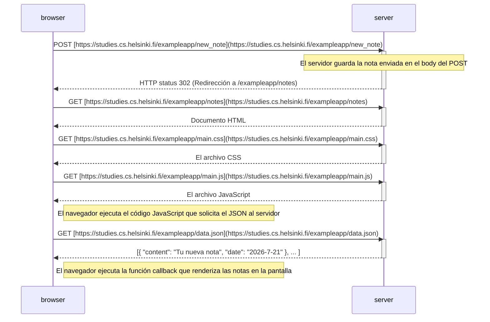

```mermaid
sequenceDiagram
    participant browser
    participant server

    browser->>server: POST [https://studies.cs.helsinki.fi/exampleapp/new_note](https://studies.cs.helsinki.fi/exampleapp/new_note)
    activate server
    Note over server: El servidor guarda la nota enviada en el body del POST
    server-->>browser: HTTP status 302 (Redirección a /exampleapp/notes)
    deactivate server

    browser->>server: GET [https://studies.cs.helsinki.fi/exampleapp/notes](https://studies.cs.helsinki.fi/exampleapp/notes)
    activate server
    server-->>browser: Documento HTML
    deactivate server

    browser->>server: GET [https://studies.cs.helsinki.fi/exampleapp/main.css](https://studies.cs.helsinki.fi/exampleapp/main.css)
    activate server
    server-->>browser: El archivo CSS
    deactivate server

    browser->>server: GET [https://studies.cs.helsinki.fi/exampleapp/main.js](https://studies.cs.helsinki.fi/exampleapp/main.js)
    activate server
    server-->>browser:El archivo JavaScript
    deactivate server

    Note right of browser:El navegador ejecuta el código JavaScript que solicita el JSON al servidor

    browser->>server: GET [https://studies.cs.helsinki.fi/exampleapp/data.json](https://studies.cs.helsinki.fi/exampleapp/data.json)
    activate server
    server-->>browser: [{ "content": "Tu nueva nota", "date": "2026-7-21" }, ... ]
    deactivate server

    Note right of browser:El navegador ejecuta la función callback que renderiza las notas en la pantalla
```