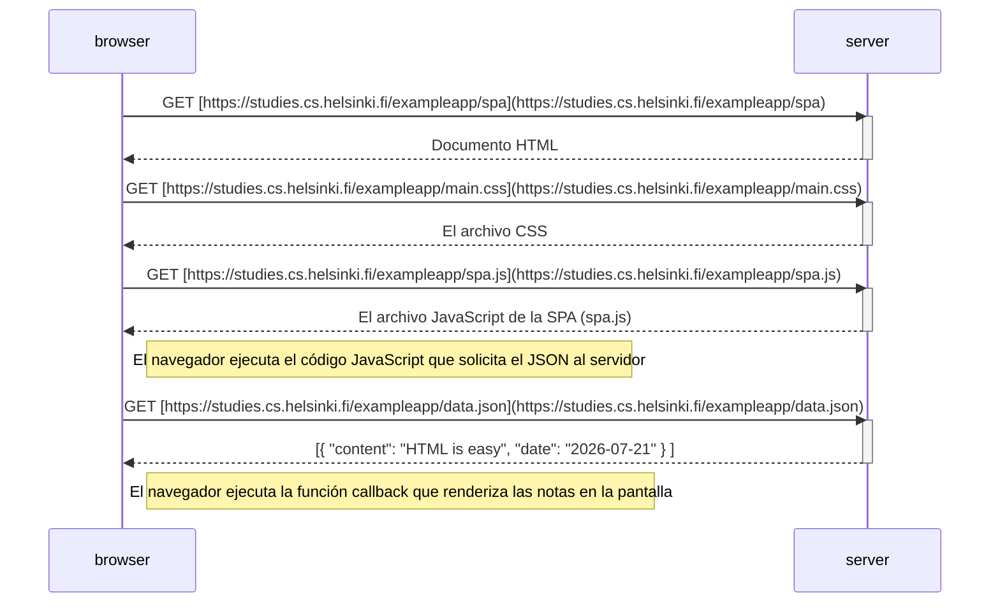

```mermaid
sequenceDiagram
    participant browser
    participant server

    browser->>server:GET [https://studies.cs.helsinki.fi/exampleapp/spa](https://studies.cs.helsinki.fi/exampleapp/spa)
    activate server
    server-->>browser: Documento HTML
    deactivate server

    browser->>server: GET [https://studies.cs.helsinki.fi/exampleapp/main.css](https://studies.cs.helsinki.fi/exampleapp/main.css)
    activate server
    server-->>browser: El archivo CSS
    deactivate server

    browser->>server:GET [https://studies.cs.helsinki.fi/exampleapp/spa.js](https://studies.cs.helsinki.fi/exampleapp/spa.js)
    activate server
    server-->>browser: El archivo JavaScript de la SPA (spa.js)
    deactivate server

    Note right of browser: El navegador ejecuta el código JavaScript que solicita el JSON al servidor

    browser->>server: GET [https://studies.cs.helsinki.fi/exampleapp/data.json](https://studies.cs.helsinki.fi/exampleapp/data.json)
    activate server
    server-->>browser: [{ "content": "HTML is easy", "date": "2026-07-21" } ]
    deactivate server

    Note right of browser: El navegador ejecuta la función callback que renderiza las notas en la pantalla
```