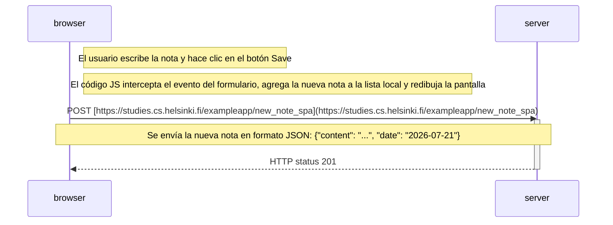

```mermaid
sequenceDiagram
    participant browser
    participant server

    Note right of browser: El usuario escribe la nota y hace clic en el botón Save

    Note right of browser: El código JS intercepta el evento del formulario, agrega la nueva nota a la lista local y redibuja la pantalla

    browser->>server: POST [https://studies.cs.helsinki.fi/exampleapp/new_note_spa](https://studies.cs.helsinki.fi/exampleapp/new_note_spa)
    activate server
    Note over browser,server: Se envía la nueva nota en formato JSON: {"content": "...", "date": "2026-07-21"}
    server-->>browser: HTTP status 201 
    deactivate server
```